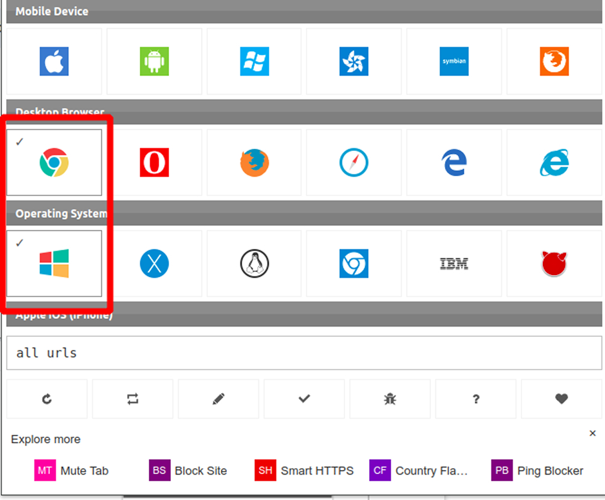

# Figma helper linux

## Installation

```bash
  npm install
```

## Run

```bash
  npm install
```

Don’t forget to install this Chrome extension (I tested it on Chrome — not sure about other browsers yet):
[User-Agent Switcher](https://chromewebstore.google.com/detail/user-agent-switcher/dbclpoekepcmadpkeaelmhiheolhjflj)

Then, make sure to select Windows as the platform and Chrome as the browser in the extension settings (as shown in the image).



## How it works

Each time you open Figma in your browser, it attempts to connect to a local server to retrieve system fonts. This mechanism is used by Figma's official applications; however, since these do not work on Linux, I developed this script as an alternative.

There is already a great repository available for this purpose, called [helpers](https://github.com/Figma-Linux/figma-linux-font-helper), and I also came across another one built with Deno, though I haven't been able to find it again. That's why I decided to write this one — to support a broader range of local fonts, allow for customization, and deepen my understanding of Express.
